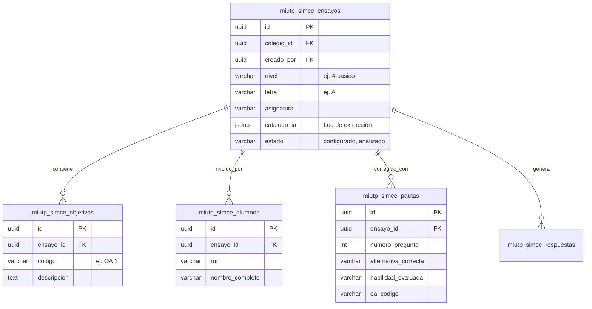

# Roadmap de Analítica Educacional - IA miUTP

Este documento describe la arquitectura de datos implementada y la visión a futuro para convertir la aplicación en una plataforma de analítica educacional accionable y profunda, adoptando patrones de trazabilidad y validación estricta de Inteligencia Artificial.

> [!IMPORTANT]
> El núcleo de la herramienta no es solo corregir Ensayos SIMCE automáticamente, sino **transformar los resultados en decisiones pedagógicas**. El sistema correlaciona métricas de acierto con Objetivos de Aprendizaje (OAs) para generar planes remediales automáticos.

---

## 1. Arquitectura de Datos (Supabase PostgreSQL)

Para soportar analítica avanzada y consultas transaccionales veloces, utilizamos un **Modelo Relacional Normalizado** híbrido en Supabase, combinando campos relacionales con metadatos en JSONB para alta flexibilidad.



---

## 2. Capa de Inteligencia Artificial y Trazabilidad

Para extraer datos no estructurados de documentos (PDFs, Word, Excel) de forma determinista, la arquitectura confía en un pipeline sólido de 3 capas:

### 2.1. Modelos Fundacionales (Google Gemini)
- Se prioriza el uso de modelos de última generación (`gemini-2.5-flash` para velocidad y `gemini-2.5-pro` para razonamiento profundo).
- La IA actúa nativamente sobre los documentos binarios (`ArrayBuffer` a `base64`) explotando las capacidades multimodales.

### 2.2. Validación Estricta (Vercel AI SDK + Zod)
En lugar de depender de JSONs frágiles generados con *prompt engineering*, se utiliza `generateObject` tipado con **Zod**.
> [!NOTE]
> Zod obliga algorítmicamente al LLM a devolver esquemas exactos (ej. listas de objetos con `numero`, `alternativaCorrecta`, `habilidad`, `objetivo`). Si la IA alucina llaves, el SDK relanza la petición internamente para corregirla.

### 2.3. Trazabilidad y Prompts Dinámicos (Langfuse)
Para evitar tocar código cuando la UTP o los docentes necesiten cambiar la instrucción de la IA, integramos **Langfuse**:
- **Prompt Management:** Los prompts de extracción (`extract-objectives-prompt`, `extract-pauta-prompt`) viven en la nube de Langfuse. Se inyectan en runtime.
- **Observabilidad:** Cada extracción registra uso de tokens, latencia, *input* binario y el JSON *output* final, facilitando la depuración en producción.

---

## 3. Visión Futura (Fase de Escaneo y Resultados OMR)

Una vez configurado el ensayo con su pauta, la Jefa de UTP cargará fotos o PDFs masivos de las **Hojas de Respuestas** completadas.

1. **Reconocimiento Óptico de Marcas (OMR) IA Visual:** 
   El motor multimodal escaneará cada hoja procesando de un vistazo:
   - Identidad del alumno (RUT / Nombre / Código de barras).
   - Burbujas marcadas (A, B, C, D) y detección de omisiones.
2. **Cruce de Datos Backend:** 
   Un JOIN nativo en Supabase cruzará las burbujas leídas contra `miutp_simce_pautas`.
3. **Persistencia (Tabla Analítica):** 
   Se alimentará la tabla `miutp_simce_respuestas` (`es_correcta: BOOLEAN`).

### Consultas Analíticas Posibles (SQL)
```sql
-- Rendimiento porcentual del curso por Habilidad Específica
SELECT 
    p.habilidad_evaluada, 
    AVG(CAST(r.es_correcta AS INT)) * 100 as porcentaje_logro
FROM miutp_simce_respuestas r
JOIN miutp_simce_pautas p ON r.pauta_id = p.id
WHERE r.ensayo_id = 'UUID_ENSAYO'
GROUP BY p.habilidad_evaluada;
```

---

## 4. Stack de Visualización Propuesto (Frontend)

Para consolidar el análisis y presentarlo con estilo "Functional Elegance" a las jefaturas técnicas:

- **Tremor (`tremor.so`) / Recharts:** Para implementar KPIs de nivel gerencial, gráficos radiales de perfiles de habilidades y matrices térmicas de respuesta (verde/rojo por cada pregunta).
- **Reportes Remediales Autogenerados:** Los datos agregados se inyectarán de vuelta a Gemini para generar reportes ejecutivos automatizados ("El 4° Básico A muestra una brecha del 40% en 'Extracción de Información Explícita'. Sugerencias de remediación: ...").
- **Stirling-PDF API:** Orquestación final para consolidar los dashboards y reportes en PDFs limpios, listos para distribuir a los apoderados.
